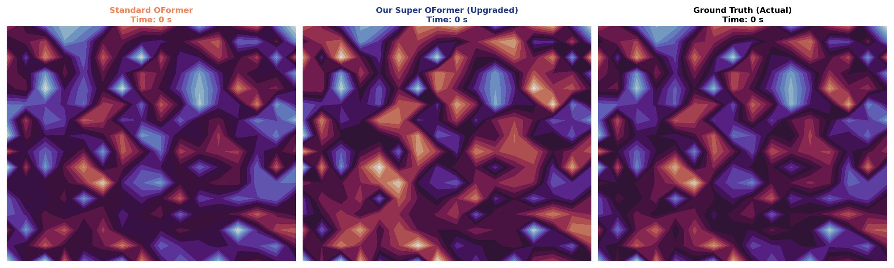

# Dawama: Aerodynamic Telemetry & Latent Flow Engine

## Executive Summary
**DAWAMA** is a specialized simulation environment designed for real time UAV velocity prediction and fluid flow reconstruction. By moving away from static regression models toward **Stateful Latent-Memory Transformers**, the system provides a robust solution to the "Inference Noise" problem in turbulent flight regimes.
*[Try Streamlit Simulation](https://dawama-9hdmpift33kzqhx9xxblw7.streamlit.app/)*

## System Logic & Data Pipeline
The core of DAWAMA relies on a dual-stage computational pipeline:

### A. Data Modeling (DeepONet Foundation)
The system models the fluid-structure interaction by mapping sensor inputs ($\mathcal{S}$) and query coordinates ($\mathcal{Q}$) to a velocity field ($\mathcal{V}$).
- **Input Space:** 8-sensor telemetry streams.
- **Output Space:** 16x16 discrete flow field grid.
- **Constraint Handling:** The model architecture assumes an implicit mapping function $\mathcal{G}: (\mathcal{S}, \mathcal{Q}) \to \mathcal{V}$.

*[Read More About Data Generation](https://github.com/omnianasa/Dawama/tree/main/data)*

### B. Architectural Innovation (The "Fitted" OFormer)
Unlike baseline models, our **Fitted DawamaOFormer** implements a persistent memory buffer:
- **Latent-State Propagation:** We inject a hidden state $KV_{t}$ derived from temporal context.
- **Attention Modification:** The attention heads are constrained to prevent divergence during "Out-of-Bounds" (OOB) flight states.

*[Read More About Modeling Phase](https://github.com/omnianasa/Dawama/tree/main/models)*

---
*DAWAMA © 2026 | Telemetry Simulation Suite*