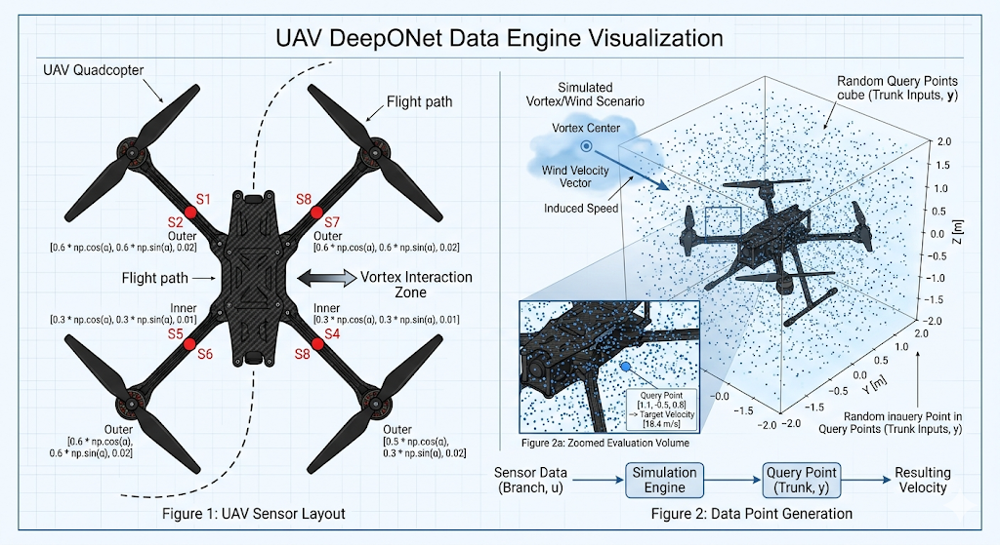

# UAV Aerodynamic Turbulence Data Engine (DeepONet)

This part of repo contains the core simulation data generation engine for modeling complex wind fields, atmospheric disturbances, and vortex rings around an Unmanned Aerial Vehicle (UAV). The engine is specifically structured to produce paired training samples suited for **Deep Operator Networks (DeepONets)**, bridging the gap between discrete on-board physical sensor arrays and continuous spatial field modeling (Sim-to-Real).

---

## Mathematical Formulation

DeepONet aims to learn an operator $\mathcal{G}: u \mapsto \mathcal{G}(u)$ that maps an input function $u$ (representing the system state or boundary conditions) to an output function $\mathcal{G}(u)(y)$ evaluated at continuous coordinates $y$.

In this aerospace fluid dynamics context:
1. **Branch Network Input ($u \in \mathbb{R}^8$):** A discretized snapshot of the wind scenario, captured as scalar pressure readings from **8 fixed pitot/differential pressure sensors** strategically distributed across the UAV frame.
2. **Trunk Network Input ($y \in \mathbb{R}^3$):** A continuous 3D spatial coordinate vector $[x, y, z]^T$ within a bounding envelope surrounding the aircraft where aerodynamic variables are queried.
3. **Target Operator Output ($\mathcal{G}(u)(y) \in \mathbb{R}$):** The resulting absolute scalar wind velocity magnitude ($V_{\text{total}}$) at the query point $y$, influenced by both steady atmospheric wind and a localized vortex structure.

### Aerodynamic Modeling Equations

The simulation framework combines a uniform ambient wind vector with a specialized structural mathematical formulation of a localized vortex field. 

#### 1. Ambient Background Wind
The steady-state atmospheric background wind is modeled as a uniform 3D velocity vector sampled across a wide flight envelopment threshold:
$$\mathbf{V}_{\text{wind}} = [V_x, V_y, V_z]^T$$

#### 2. Localized Vortex Field
To simulate aggressive, localized microbursts, wakes, or wingtip vortex interactions, the engine embeds a structural fluid vortex characterized by its core center $\mathbf{x}_c$, maximum structural radius $R_v$, and circulation strength $\Gamma$. 

The induced velocity at any spatial coordinate $\mathbf{x}$ is calculated based on its radial distance from the vortex core ($r = \|\mathbf{x} - \mathbf{x}_c\|$). To prevent numerical singularities at the vortex core ($r \to 0$), a solid-body rotation model is applied inside the core radius, transitioning smoothly into an irrotational potential flow model externally:

$$V_{\text{induced}}(r) = \begin{cases} 
\frac{\Gamma \cdot r}{2\pi R_v^2}, & \text{if } r < R_v \quad \text{(Solid-body core rotation)} \\
\frac{\Gamma}{2\pi r}, & \text{if } r \ge R_v \quad \text{(Potential flow decay)}
\end{cases}$$

#### 3. Total Velocity Field Mapping
The complete velocity vector field at any spatial position is the vector summation of the uniform background wind and the orthogonal tangential components induced by the vortex field. The target scalar magnitude is computed as:
$$V_{\text{total}}(\mathbf{x}) = \sqrt{\|\mathbf{V}_{\text{wind}}\|^2 + V_{\text{induced}}(\mathbf{x})^2}$$

#### 4. Sensor Pressure Mapping (Bernoulli Transition)
The discrete branch inputs $u$ are computed by evaluating the total localized velocity at the fixed spatial coordinates of the 8 sensors ($\mathbf{x}_{s,i}$). Using Bernoulli’s principles under incompressible assumptions, the kinetic energy of the fluid is mapped directly to dynamic pressure measurements:
$$P_{\text{dynamic}, i} = \frac{1}{2} \rho_{\text{air}} \cdot V_{\text{total}}(\mathbf{x}_{s,i})^2 + \mathcal{N}(0, \sigma^2)$$
*Where $\rho_{\text{air}} = 1.225 \text{ kg/m}^3$ and $\mathcal{N}(0, \sigma^2)$ injects Gaussian noise ($\sigma = 12.5\text{ Pa}$) to simulate structural vibration, sensor drift, and electronic noise typical of hardware deployments.*

---

## Physical Sensor Configuration

The 8 sensors are organized in a symmetric concentric configuration across the multirotor airframe to capture spatial pressure gradients along primary flight axes. 

* **Outer Ring ($R = 0.6\text{m}$):** Four sensors positioned at $90^\circ$ increments along the motor arms to capture macro-level gradient variances.
* **Inner Ring ($R = 0.3\text{m}$):** Four sensors positioned closer to the central avionics bay, providing localized high-density reference snapshots.

| Sensor ID | Ring | Angular Position ($\alpha$) | Spatial Coordinates $[x, y, z]$ (meters) |
| :--- | :--- | :--- | :--- |
| **Sensor_P1** | Outer | $0^\circ$ (Front) | $[0.60, 0.00, 0.02]$ |
| **Sensor_P2** | Inner | $0^\circ$ (Front) | $[0.30, 0.00, 0.01]$ |
| **Sensor_P3** | Outer | $90^\circ$ (Left) | $[0.00, 0.60, 0.02]$ |
| **Sensor_P4** | Inner | $90^\circ$ (Left) | $[0.00, 0.30, 0.01]$ |
| **Sensor_P5** | Outer | $180^\circ$ (Rear) | $[-0.60, 0.00, 0.02]$ |
| **Sensor_P6** | Inner | $180^\circ$ (Rear) | $[-0.30, 0.00, 0.01]$ |
| **Sensor_P7** | Outer | $270^\circ$ (Right) | $[0.00, -0.60, 0.02]$ |
| **Sensor_P8** | Inner | $270^\circ$ (Right) | $[0.00, -0.30, 0.01]$ |

---

## Dataset Structure 

The generated dataset is serialized as a single, flat-file structured CSV containing **100,000 data rows** (1,000 unique weather trajectories $\times$ 100 continuous evaluation query points per trajectory).

### Output CSV Schema

| Column Name | Type | Unit | Component | Description |
| :--- | :--- | :--- | :--- | :--- |
| `Sensor_P1` | Float | Pascal (Pa) | **Branch Input** | Dynamic pressure recorded by Outer Front sensor |
| `Sensor_P2` | Float | Pascal (Pa) | **Branch Input** | Dynamic pressure recorded by Inner Front sensor |
| `Sensor_P3` | Float | Pascal (Pa) | **Branch Input** | Dynamic pressure recorded by Outer Left sensor |
| `Sensor_P4` | Float | Pascal (Pa) | **Branch Input** | Dynamic pressure recorded by Inner Left sensor |
| `Sensor_P5` | Float | Pascal (Pa) | **Branch Input** | Dynamic pressure recorded by Outer Rear sensor |
| `Sensor_P6` | Float | Pascal (Pa) | **Branch Input** | Dynamic pressure recorded by Inner Rear sensor |
| `Sensor_P7` | Float | Pascal (Pa) | **Branch Input** | Dynamic pressure recorded by Outer Right sensor |
| `Sensor_P8` | Float | Pascal (Pa) | **Branch Input** | Dynamic pressure recorded by Inner Right sensor |
| `Query_X` | Float | Meters (m) | **Trunk Input** | Arbitrary Evaluation coordinate $x \in [-2.0, 2.0]$ |
| `Query_Y` | Float | Meters (m) | **Trunk Input** | Arbitrary Evaluation coordinate $y \in [-2.0, 2.0]$ |
| `Query_Z` | Float | Meters (m) | **Trunk Input** | Arbitrary Evaluation coordinate $z \in [-2.0, 2.0]$ |
| `Target_Velocity`| Float | m/s | **Target Output** | Scalar value of total field velocity magnitude at `Query_(X,Y,Z)` |

---

