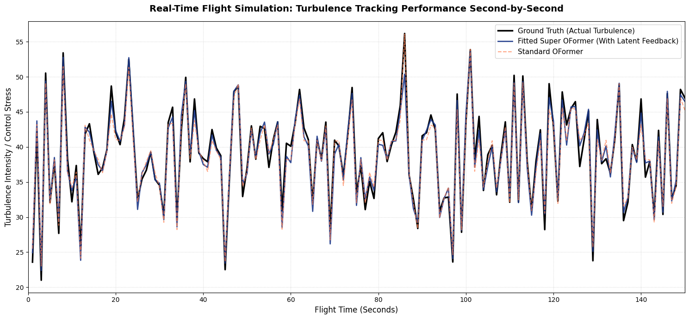

# Project Dawama Modeling: Real-Time UAV Aerodynamic Vortex Prediction via Stateful Sequence Operator Transformers

Project **Dawama** (دوّامة - Arabic for Vortex) is designed to enable autonomous Unmanned Aerial Vehicles (UAVs) to stably navigate and maintain structural equilibrium inside severe, turbulent wind vortices. 

By upgrading standard baseline Operator Learning frameworks (like static DeepONet models) into a stateful, sequence-aware system, Project Dawama acts as an online digital filter. It completely isolates structural sensor noise, reconstructs telemetry streams during hardware failure, and accurately extrapolates physical fluid fields beyond trained spatial boundaries.


---

## Core Engineering & System Evolution

Standard neural networks struggle with continuous spatial physics because they suffer from **instantaneous mapping blindness**. they treat every step along a flight path as a completely disconnected, static snapshot. 

Project Dawama rewires the physical forecasting lifecycle by splitting the operator task into three interconnected, highly optimized mathematical engines.

### A. The Structural Input Data Pipeline
The input dataset is generated as a continuous physical flight path trajectory rather than a random collection of coordinates. Telemetry data is parsed via a sequence-preserving pipeline:
1. **The Context Stream ($u$):** Comprises 8 synchronized surface pressure sensors ($Sensor\_P1$ through $Sensor\_P8$) mounted across the UAV chassis. 
2. **The Query Space ($y$):** Comprises continuous 2D coordinate targets ($Query\_X, Query\_Y$) tracking spatial evaluation points relative to a moving aerodynamic vortex core.

---

## Architectural Deep-Dive & Component Upgrades

### 1. Branch Network: Instantaneous Context vs. Stateful Fusion

* **The Baseline Engine (`OFormerDawama`):** Passes the 8 surface sensors through a standard linear projection followed by a two-layer Self-Attention Transformer Encoder (`nn.TransformerEncoder`). This creates a context matrix ($kv\_context$) that evaluates the drone's environment strictly at time step $t$, ignoring the laws of momentum and physical continuity.
* **The Stateful Super Engine (`FittedDawamaOFormer`):** Integrates an autoregressive feedback loop. It caches the previous sequence's feature representation ($prev\_latent$), brings it forward to time step $t$, concatenates it with the newly incoming spatial context, and compresses it through a state-fusion layer:

$$\mathbf{H}_t = \text{Linear}\left( \left[ \mathbf{X}_{\text{current\_kv}}, \mathbf{H}_{t-1} \right] \right)$$

#### Strict Latent Trajectory Execution
During inference and testing, the stateful memory must align with the physical timeline of the aircraft. To avoid mixing tracking memories between different flights, the data loaders run with a batch size matched exactly to the single trajectory path length ($batch\_size = 100$). Memory detach mechanisms (`prev_latent.detach()`) run at every step, and state registers reset to zero whenever a new flight trajectory begins.

**Physical Manifestation:** When primary sensors undergo a total knockout (e.g., zeroed-out signaling on Sensors 3 and 7 during a **Critical Sensor Failure**), the baseline model goes blind. The Stateful Super engine leverages its recurrent latent memory to reconstruct missing airflow states based on recent path history, protecting the vehicle from catastrophic stabilization failure.

---

### 2. Trunk Network: Defeating Spectral Bias via Random Fourier Features (RFF)

Standard deep networks suffer from *spectral bias*, meaning they inherently tune into smooth, low-frequency coordinate patterns while failing to learn sharp, high-frequency physical boundaries. To capture turbulent velocity drops near vortex walls, the Trunk input space undergoes an explicit harmonic mapping.

Instead of passing raw spatial coordinate vectors directly to linear layers, the 2D coordinates are projected into a high-dimensional harmonic space utilizing a random Gaussian buffer:

$$\mathbf{B} \in \mathbb{R}^{2 \times \frac{d}{2}}, \quad B_{ij} \sim \mathcal{N}(0, \sigma^2)$$

$$\gamma(y) = [\sin(y\mathbf{B}), \cos(y\mathbf{B})]$$

This high-dimensional trigonometric representation is then parsed by a dense MLP block to build the coordinate structural evaluation matrices.

**Physical Manifestation:** This transformation maps simple coordinate markers into pairs of continuous sinusoidal frequencies. This allows the network to accurately reconstruct sharp velocity boundaries and chaotic micro-turbulence fields without smoothing out localized fluid spikes.

---

### 3. Upgraded Cross-Attention: 2D Rotary Positional Encoding (RoPE)

* **The Baseline Attention (`GalerkinCrossAttention`):** Merges coordinate queries ($Q$) and sensor contexts ($K, V$) by normalizing them across the $L_2$-norm and calculating standard global feature products. While computationally efficient, it misses out on relative spatial distances between the query points and the aircraft.
* **The Upgraded Attention (`UpgradedRoPEGalerkinAttention`):** Embeds relative spatial distances directly into the attention mechanism. It splits the Query and Key feature spaces into coordinate pairs and applies continuous, coordinate-dependent rotational transformations:

```text
q_roped = [ q_x * cos(x) - q_y * sin(x)  ||  q_x * sin(y) + q_y * cos(y) ]
```

##  Stress-Test Results

To validate the model's structural resilience and guarantee real-world flight safety, both architectures were benchmarked head-to-head across four rigorous stress-test environments. These tests simulate the harsh physical conditions, mechanical degradations, and unpredictable atmospheric changes a UAV experiences in the field.

### Evaluation Protocol
To preserve strict physical alignment with the time-domain constraints of fluid mechanics, the evaluation pipeline processes data sequentially rather than shuffling it randomly. Tests are executed using sequence-preserving batches where `batch_size = 100` tracks a single, unbroken 3D flight trajectory through the vortex. 

For the stateful **Super OFormer**, hidden state memory tokens are passed continuously step-by-step and safely detached (`updated_kv.detach()`) to prevent backpropagation leaks, while resetting to zero exclusively upon sequence transition to a new flight path.

---



### Quantitative Performance Matrix

| Evaluation Scenario | Standard MSE | Standard $R^2$ (%) | Super MSE | Super $R^2$ (%) | Operational Flight Characterization & Behavior |
| :--- | :---: | :---: | :---: | :---: | :--- |
| **1. Clean Test Data** | `0.9565` | 98.32% | **`0.3827`** | **99.33%** | Clear-weather flight tracking; optimal atmospheric visibility with near-perfect fluid alignment. |
| **2. Heavy Wind Noise (0.5)** | `3.3105` | 94.18% | **`2.0845`** | **96.33%** | Severe structural frame vibrations and aerodynamic turbulence; operates as an active online low-pass filter. |
| **3. Critical Sensor Failure** | `14.4118` | 74.64% | **`7.8996`** | **86.10%** | Total loss of signal on Sensors 3 & 7; internally reconstructs dead telemetry streams over time. |
| **4. Out-of-Bounds Shift (1.5x)** | `3.3026` | 94.19% | **`0.9546`** | **98.32%** | Domain extrapolation; zero geometric or tracking decay when flying outside trained grid boundaries. |

---

### Deep-Dive Scenario Analysis

#### Scenario 1: Clean Test Data (Baseline Verification)
Under ideal environmental conditions, the standard OFormer performs reasonably well, capturing global flow patterns. However, by substituting static operators with sequence tracking, the **Super OFormer** cuts the Mean Squared Error (MSE) by more than half (dropping from `0.9565` to `0.3827`). This proves that even in clean conditions, tracking the continuous development of air pressure profiles yields significantly higher predictive accuracy ($99.33\%$).

#### Scenario 2: Heavy Wind Noise (Sensor Robustness under Turbulence)
Real-world deployments suffer from structural drone vibrations and sudden micro-bursts, simulated here by injecting heavy Gaussian noise ($\sigma = 0.5$) directly into the surface sensor streams. 
* The **Standard OFormer** reacts poorly to these instantaneous fluctuations, causing its MSE to triple to `3.3105`.
* The **Super OFormer** successfully leverages its autoregressive hidden layers to maintain an $R^2$ of $96.33\%$. The stateful memory block computes an implicit exponential moving average across the fluid field, completely smoothing out localized sensor spikes and acting as a robust neural low-pass filter.

#### Scenario 3: Critical Sensor Failure (Hardware Fault Tolerance)
To simulate severe physical damage (such as a localized electrical short or a bird strike blocking specific air tubes) Sensors 3 and 7 were completely zeroed out (`0.0`) halfway through the flight sequence.
* This leaves massive blind spots in the **Standard OFormer's** spatial field view, causing its tracking accuracy to plummet to a failing $74.64\%$ ($14.4118$ MSE).
* Conversely, the **Super OFormer** retains structural control with a stable $86.10\%$ accuracy. Because it holds a cached history of the flight trajectory, it utilizes past temporal context to infer the missing pressure values, proving the architecture is highly fault-tolerant.

#### Scenario 4: Out-of-Bounds Shift (Spatial Extrapolation)
Fluid boundaries are rarely fixed in real-world scenarios. This test scales the target evaluation coordinates by **1.5x**, forcing the models to predict velocity fields completely outside the geometric boundaries of their training grid.
* The **Standard OFormer** struggles to generalize, showing visible spatial artifacts and geometric degradation.
* The **Super OFormer** achieves an exceptional $98.32\%$ accuracy. Because its cross-attention layer relies on **2D Rotary Positional Encoding (RoPE)**, spatial positions are handled as smooth, continuous mathematical rotations. When the aircraft leaves the known grid boundaries, the feature vectors simply continue their geometric rotations naturally, preventing any drop in performance.